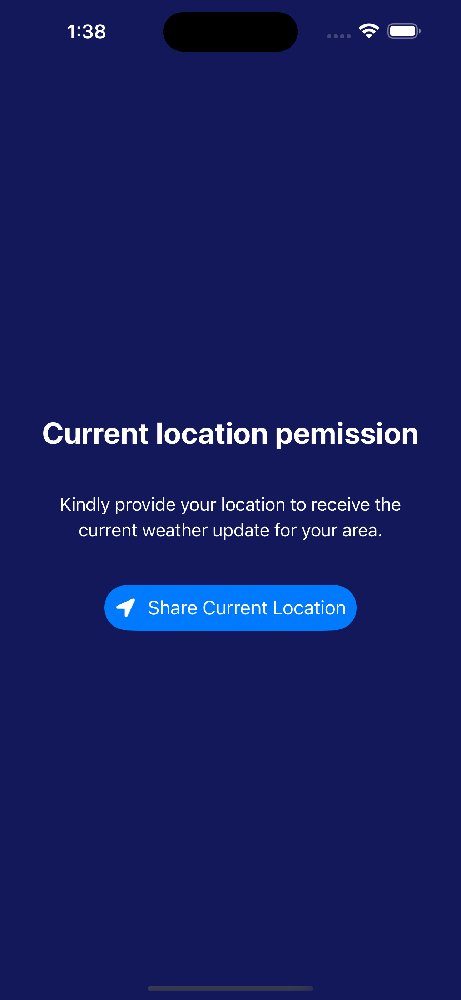
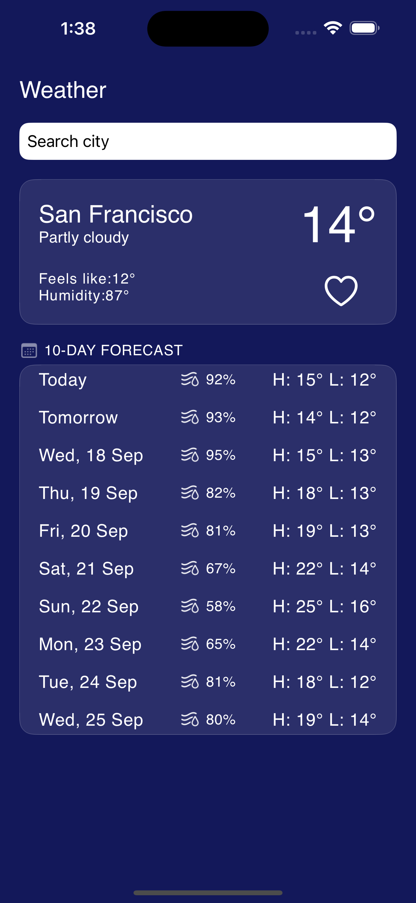
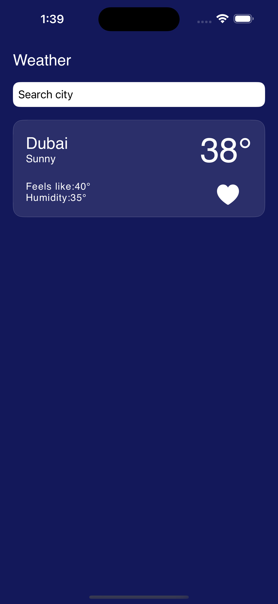
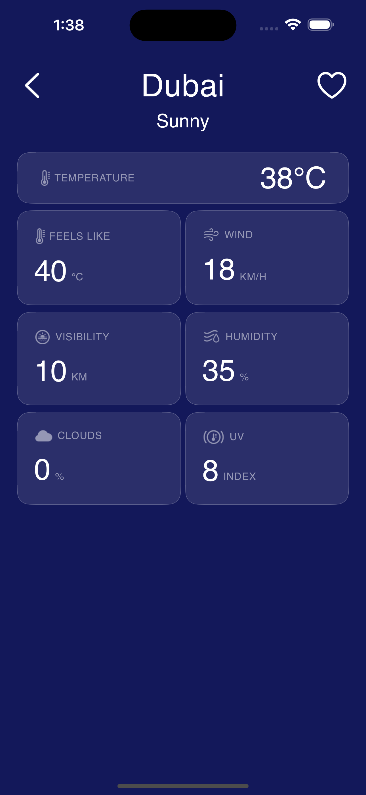
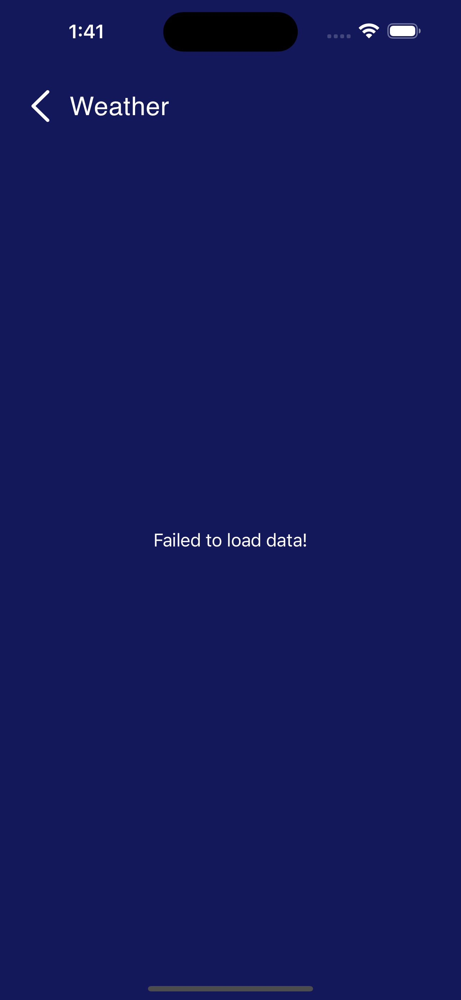
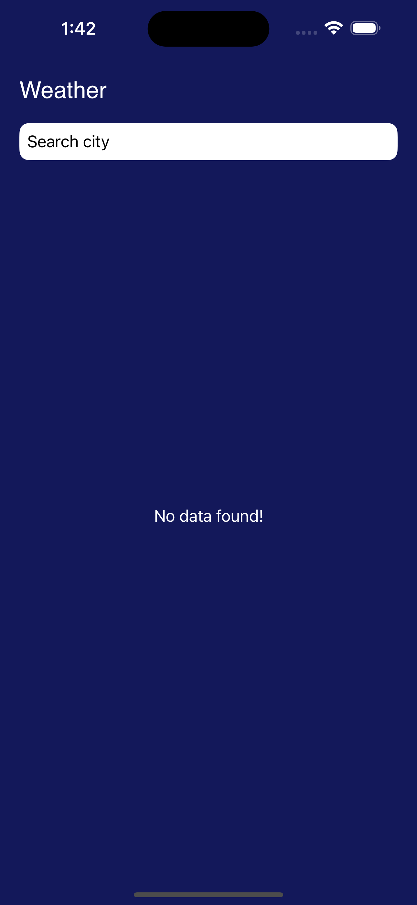

# Equiem Tech Assignment - Weather App
This app shows user weather of current location with 10 days forcast; let's them search and save locations

## Design Pattern:
Clean Architecture MVVM (Model View View Model)

Above image used from [this](https://medium.com/@ami0275/mvvm-clean-architecture-pattern-in-android-with-use-cases-eff7edc2ef76) article

## Weather Endpoint:

App uses (Weather API: Realtime)[https://app.swaggerhub.com/apis-docs/WeatherAPI.com/WeatherAPI/1.0.2#/APIs/realtime-weather] to get weather through city name.
App uses (Weather API: Forecast)[https://app.swaggerhub.com/apis-docs/WeatherAPI.com/WeatherAPI/1.0.2#/APIs/forecast-weather] to get forecaset for 10 days through cooridnates.
 

## Application Flow:
App starts with request for location on first launch showing forecast and option to search for cities:

### Location Request Screen:

| Location request |
| :----: | 
 |

### Weather List Screen
| Current Location Weather | Saved Location Weather |
| :----: | :----: |
 | 

| Details Screen |
| :----: | 
 |

### Error and Empty Screens
| Error Loading Data | Empty Saved Location |
| :----: | :----: |
 | 

## Testing

The project contains unit tests and UI tests

### Unit Tests
- Weather Repository
- Weather Local Data Source
- Weather Remote Data Source

### UI Tests
- Weather View

## Libraries:
- SwiftUI
- State and StateObject for data management
- UserDefaults for caching data
- (Json to Swift Model Convertor)[https://app.quicktype.io/]
